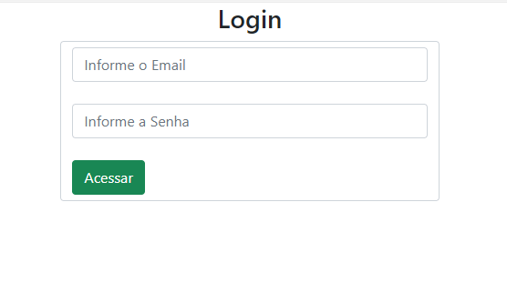
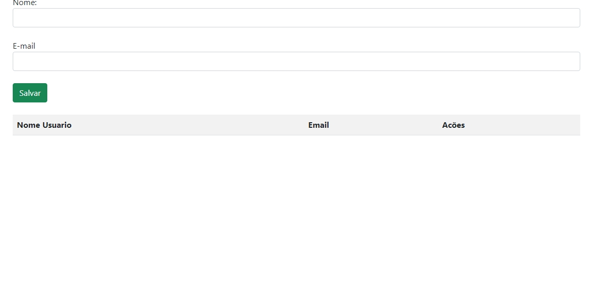
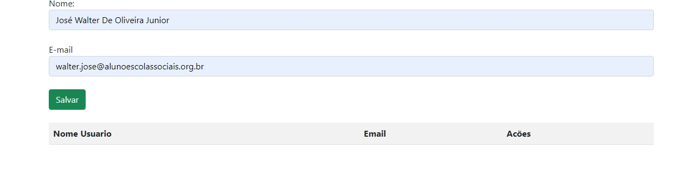
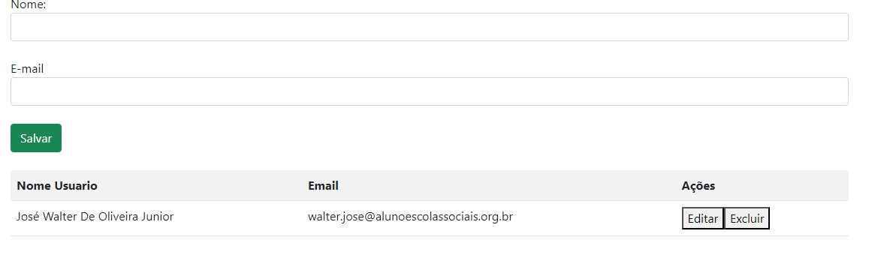

# Cadastro de Usuarios V0.1

### Descrição do Projeto:

O projeto de cadastro de usuarios vem da ideia de conseguir inserir seu email e senha em um cadastro e entrar em um site onde você possa salvar seu email e seu nome de usuario, onde tambem e possivel você editar ou ate mesmo excluir oque você salvou, Tudo isso com o uso de JavaScript, CSS e HTML 

# Indice
- [Titulo](#cadastro-de-usuarios-v01)
- [Descrição do Projeto](#descrição-do-projeto)
- [Funcionalidades](#funcionalidades)
- [Como abrir e rodar o codigo]()
- [Aplicação]()
- [Ferramentas Utilizadas]()
- [Desenvolvedores]()

# Funcionalidades
Funcionalidades do projeto:
- `Funcionalidade 1`: O site consegue cadastrar um usuario e uma senha, onde ele pode ser validado (tornar ou declarar válido).
- `Funcionalidade 2`: Tambem e possivel salvar seu Usuario e seu Gmail, caso esqueça, onde tambem são validados automaticamente via JavaScript
- `Funcionalidade 3`: O site tambem consegue fazer com que você possa Editar e ate mesmo excluir o email e usuario indicados 

- `Funcionalidade 4`: É possivel tambem salvar mais de um usuario e um email no site, onde e possivel guardar suas contas futuramente


# Como Abrir e rodar o codigo
## 📁 Acesso ao projeto

**Você pode Baixar o projeto por este [Link]() ou se quiser ver diretamente o codigo, use este Link a baixo:**

```https://github.com/Queijitos/Login-Cad.git```

## 🛠️ Abrir e rodar o projeto


**Para abrir e rodar o Projeto tendo o baixado, logo depois ir ate a pasta escolhida para o download, tambem pode ate ir para a pasta de donwloads**
### 🔧  Extraindo a pasta 	
**depois você tera que extrair a pasta do projeto**
###	💻 Abrindo e rodando o codigo
**entrando na pasta Você tera que entrar no arquivo de site ["login.html"](login.html),
assim que entrar no site**


<br>

**🛠️ Assim que você logar no site, você sera direcionado para o site de cadastro de usuarios e de email:**

**🛠️ Para seguir e salvar o seu usuario e senha você tera que ir Colocando no campo de Usuario e Email, suas informações:**

**🛠️ E por fim quando você apertar o botão de salvar, o codigo ira rodar e você fara com que fique salvo no sistema:**


# ❔Como funciona o codigo?
